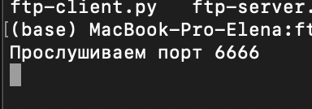
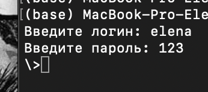
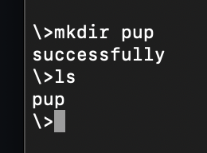
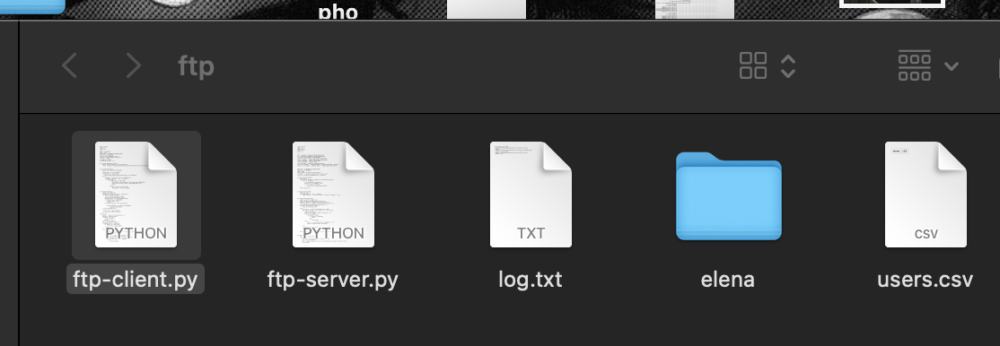
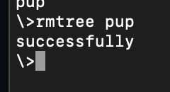
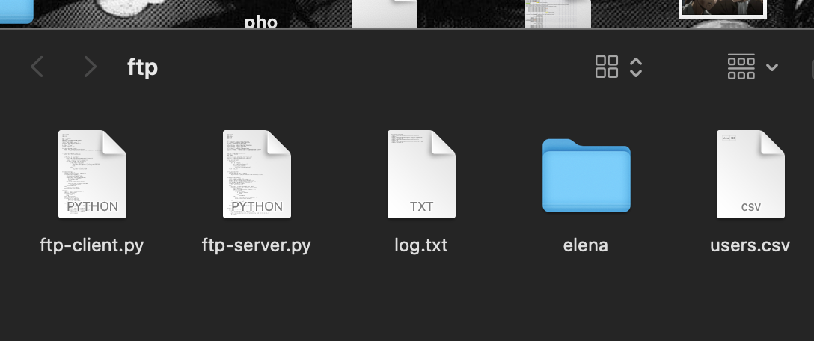
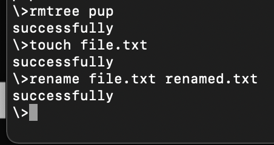
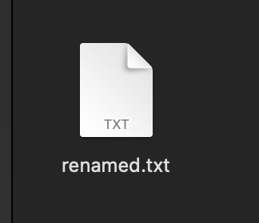
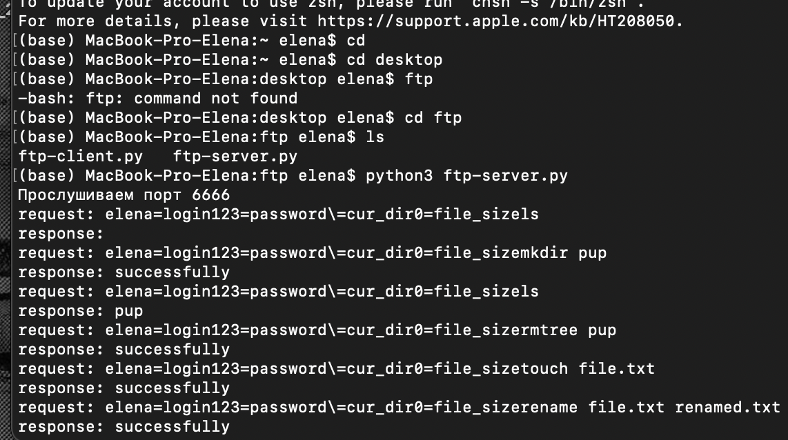

# Основные задания:
Посмотреть содержимое папки; Верхнее окно - клиент, нижнее - сервер.

Создать папку;

Удалить папку;

Удалить файл; Создание и переименование далее
Переименовать файл;

Добавьте логирование всех действий сервера в файл. Можете использовать разные файлы для разных действий, например: подключения, авторизации, операции с файлами. Логи пишутся в файл корень сервера log.txt

